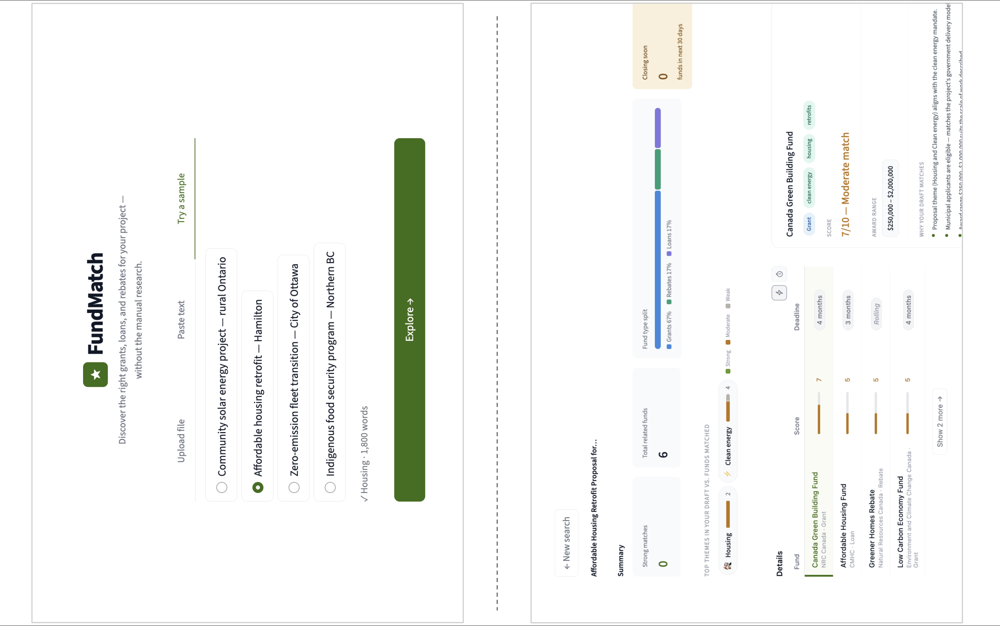

# FundMatch

> A semantic AI pipeline that matches draft proposals to relevant funding opportunities across US and Canadian sources.

Intelligent funding discovery for proposal writers. Upload a draft proposal and get a ranked dashboard of matching grants, loans, and rebates — powered by semantic AI matching.

## Demo



---

## Data Analytics Pipeline

FundMatch demonstrates a complete data analytics workflow:

- **Ingestion**: Web scraping and RSS feed parsing to collect funding opportunities from US and Canadian sources (Grants.gov, Canadian federal agencies, nonprofits).
- **Processing**: Semantic text embedding using `sentence-transformers` (all-MiniLM-L6-v2) to vectorize proposals and fund descriptions.
- **Matching**: Cosine similarity scoring between proposal embeddings and fund embeddings; ranked retrieval with match strength classification.
- **Classification**: Zero-shot theme extraction using `facebook/bart-large-mnli` to identify funding focus areas.
- **Eligibility checking**: Zero-shot NLI classification to verify whether a proposal satisfies each fund's stated eligibility criteria.
- **Deduplication**: Automatic detection and merging of duplicate fund entries across scrapers.
- **Visualization**: Interactive Streamlit dashboard showing top matches with scores, eligibility verdicts, and contact details.

## Stack

- **UI**: Streamlit [hosted on Streamlit Community Cloud](https://ola-fundmatch.streamlit.app/)
- **Matching**: `sentence-transformers` (all-MiniLM-L6-v2) via Hugging Face
- **Theme extraction & eligibility**: `facebook/bart-large-mnli` zero-shot classifier
- **Document parsing**: `pdfplumber` (PDF), `python-docx` (DOCX)
- **Fund data**: `data/funds.json` — kept fresh by a weekly GitHub Actions crawl

## Local setup

```bash
git clone https://github.com/15121connect/fundmatch
cd fundmatch
python -m venv .venv
source .venv/bin/activate      # Windows: .venv\Scripts\activate
pip install -r requirements.txt
streamlit run app.py
```

The first run will download the sentence-transformers model (~80 MB). Subsequent runs use the cached version.

## Project structure

```
fundmatch/
├── app.py                  # Landing page (Streamlit entry point)
├── pages/
│   └── dashboard.py        # Results dashboard
├── core/
│   ├── parser.py           # PDF/DOCX → plain text
│   ├── embedder.py         # HF model loader + encode helpers
│   ├── matcher.py          # Cosine similarity scoring + ranking
│   ├── themes.py           # Zero-shot theme extraction
│   ├── eligibility.py      # Proposal ↔ fund eligibility checks
│   └── explanations.py     # Match reason generation
├── data/
│   ├── funds.json          # Fund database (updated by crawler)
│   └── samples/            # Sample proposal .txt files
├── crawler/
│   ├── base.py             # BaseScraper + DB helpers
│   ├── run_crawl.py        # Crawl entry point
│   └── scrapers/
│       └── nrc.py          # Example scraper (add one per funder)
├── .github/workflows/
│   └── crawl.yml           # Weekly GitHub Actions crawl
├── .streamlit/
│   └── config.toml         # Theme colours
└── requirements.txt
```

## Adding a new fund scraper

1. Create `crawler/scrapers/yourfunder.py`
2. Subclass `BaseScraper`, set `FUND_ID` and `SOURCE_URL`
3. Implement `scrape()` — return a `FundRecord`
4. Run `python -m crawler.run_crawl --dry-run` to test

The crawler auto-discovers all scrapers in `crawler/scrapers/` — no registration needed.

## Adding a sample proposal

Drop a `.txt` file into `data/samples/` and add an entry to the `SAMPLES` list in `app.py`.

## Deploying to Streamlit Community Cloud

1. Push repo to GitHub (public or private)
2. Go to [share.streamlit.io](https://share.streamlit.io) → New app
3. Set **Main file path** to `app.py`
4. Add any secrets (e.g. `HF_API_TOKEN`) via the Secrets panel
5. Deploy

> **Memory note**: `all-MiniLM-L6-v2` uses ~200 MB RAM. Streamlit Community Cloud's free tier allows 1 GB — comfortable. If you upgrade to `all-mpnet-base-v2` (~420 MB) you'll still fit. `bart-large-mnli` for local theme extraction (~1.5 GB) will exceed the free tier — use the HF Inference API instead by setting `HF_API_TOKEN` in Streamlit secrets and passing it to `extract_themes()`.

## Tuning match quality

Edit the thresholds in `core/matcher.py`:

```python
STRONG_THRESHOLD   = 0.70   # cosine similarity ≥ this → "strong"  (score 7-10)
MODERATE_THRESHOLD = 0.40   # ≥ this → "moderate"                  (score 4-6)
```

And the fund text representation in `_fund_text()` — richer descriptions produce better embeddings.

## Roadmap

- [ ] **Boost your odds** — LLM-powered proposal tailoring per fund
- [ ] **Email alerts** — notify when new funds match a saved proposal
- [ ] **Export** — download matched funds as CSV or PDF
- [ ] **Multi-language support** — French proposal handling for Quebec funds
- [ ] **Saved searches** — persist proposals and results across sessions
